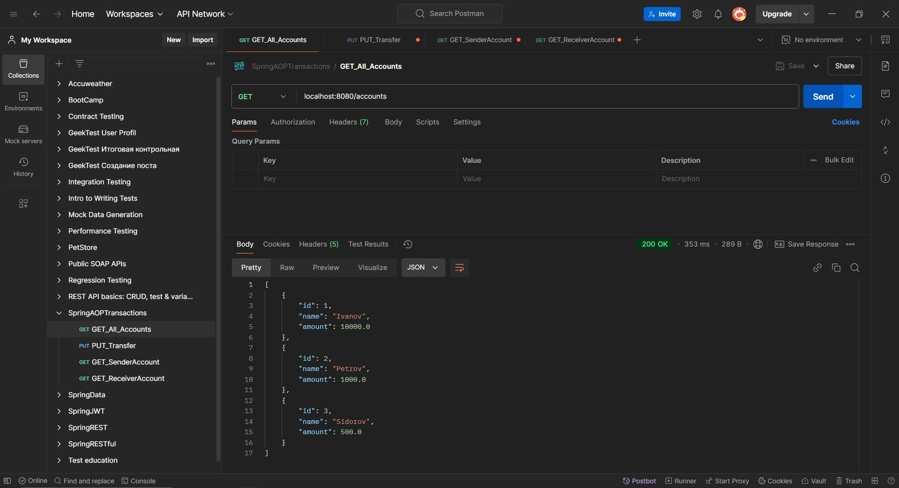
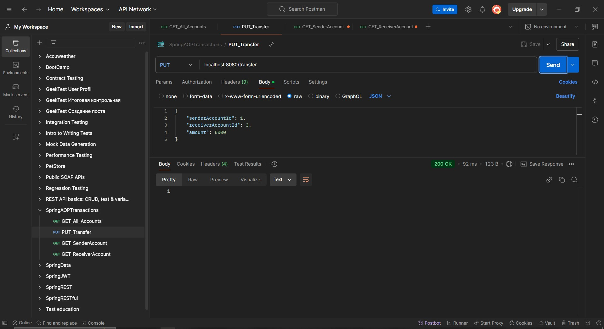
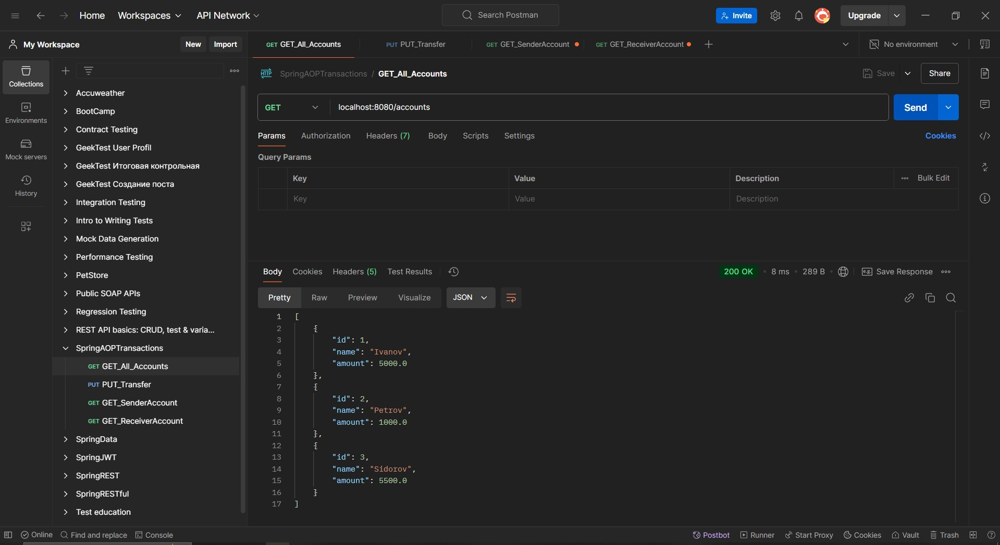
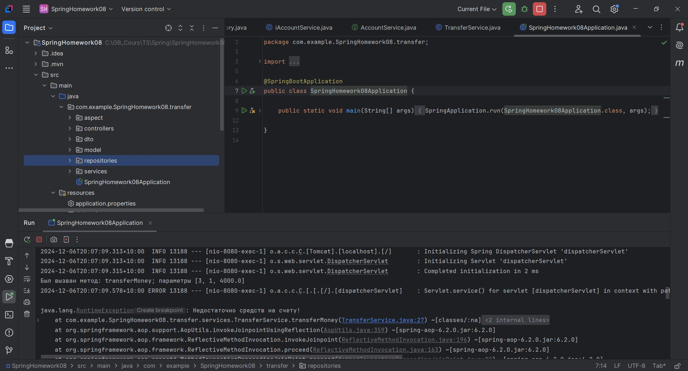
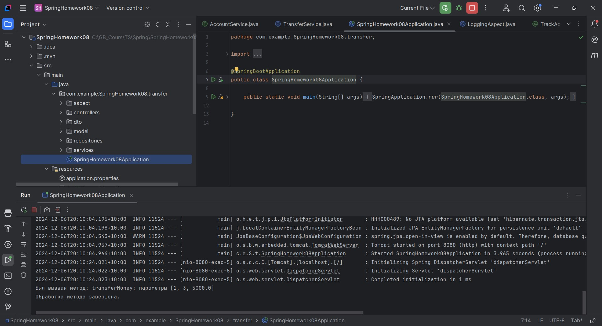

# Урок 8. Spring AOP, управление транзакциями.

Задание: 
Продемонстрируйте применение Spring AOP для логирования операций в вашем приложении. 
Подумайте, как можно применить управление транзакциями для обеспечения целостности данных.

========================================================================================

## Демонстрация решения:

### Postman:

### Logs:

